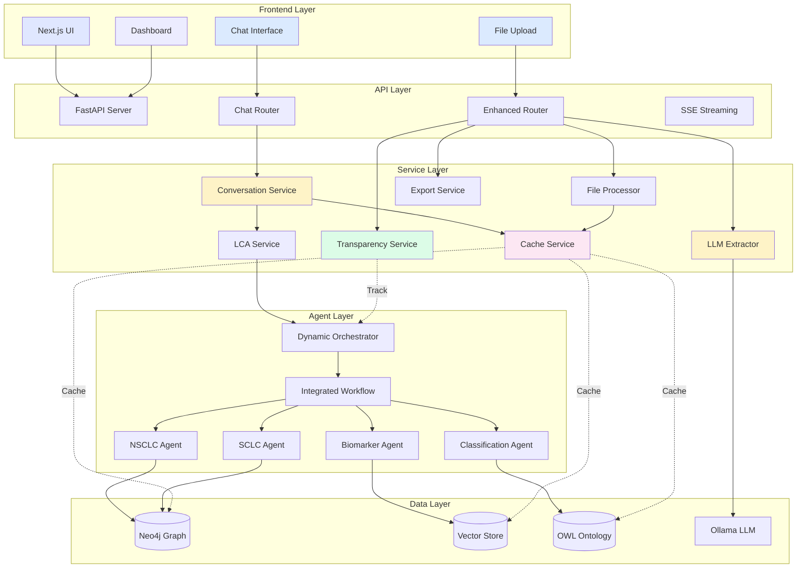
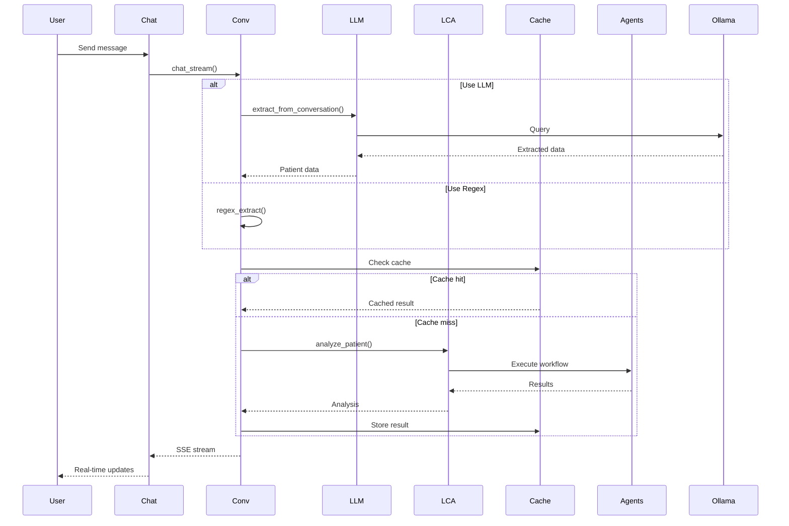
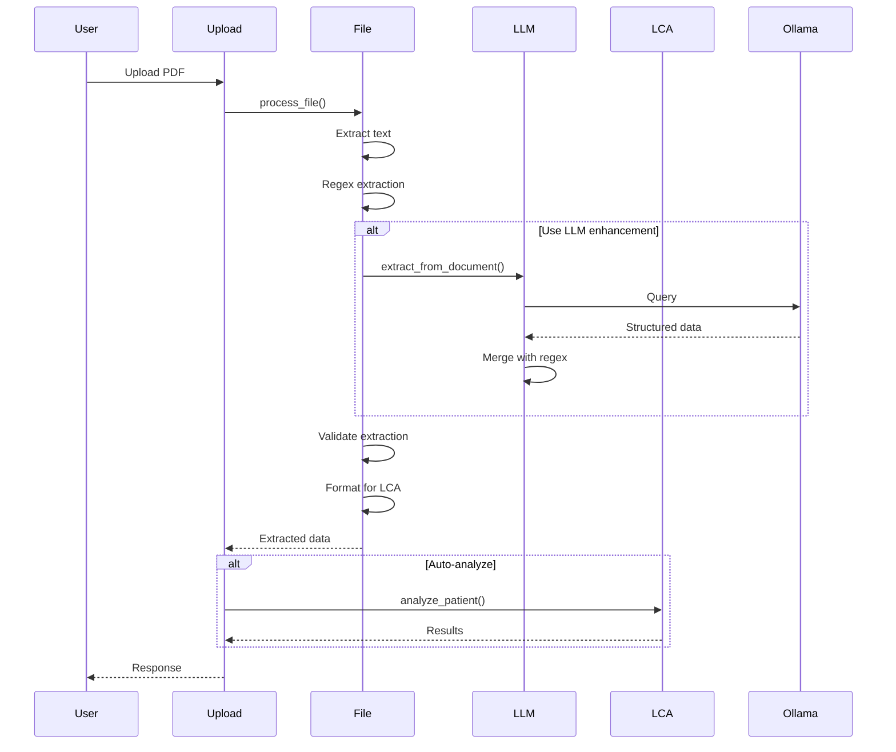
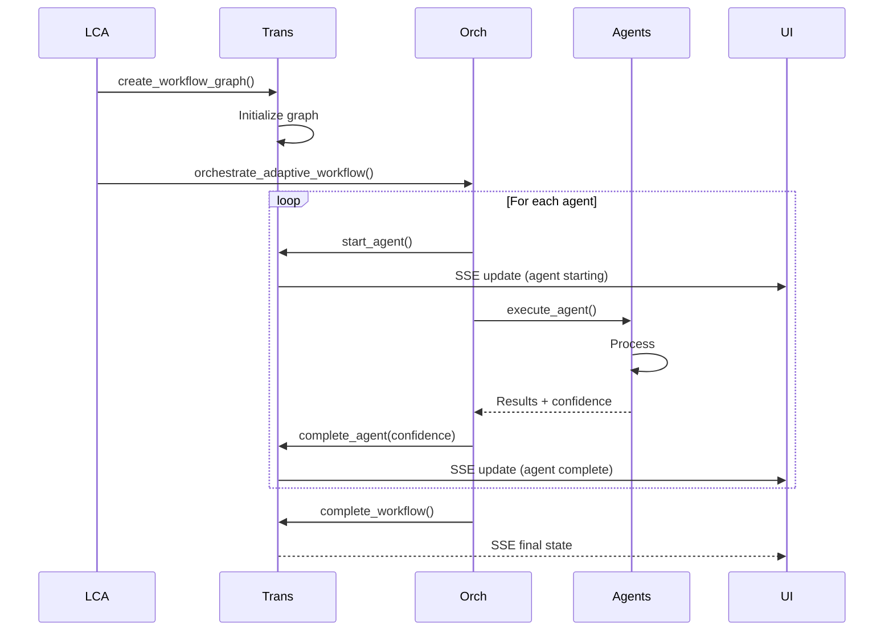
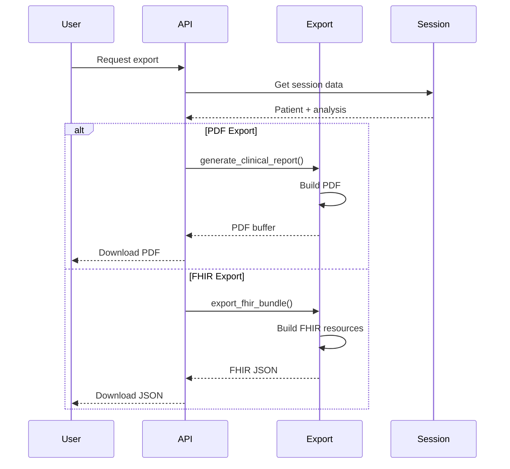
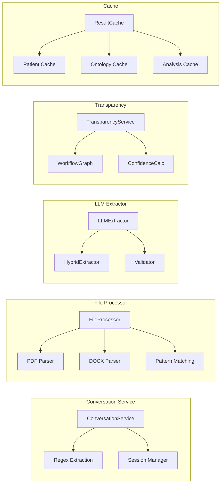
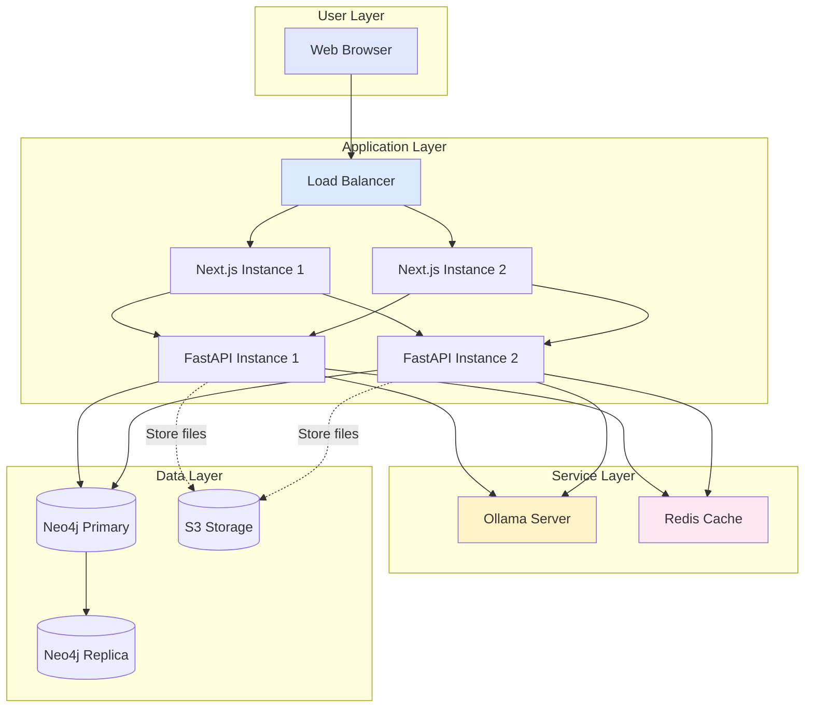
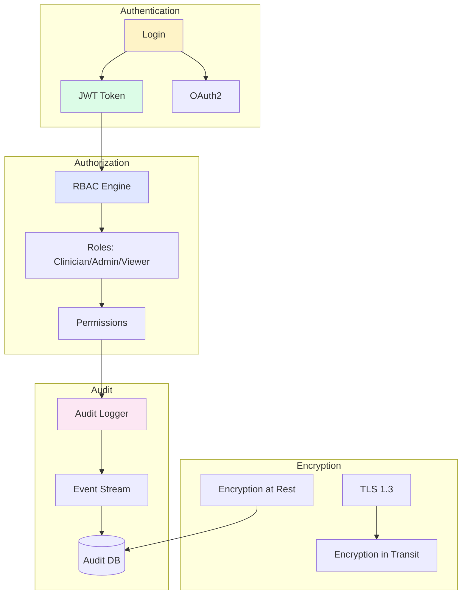
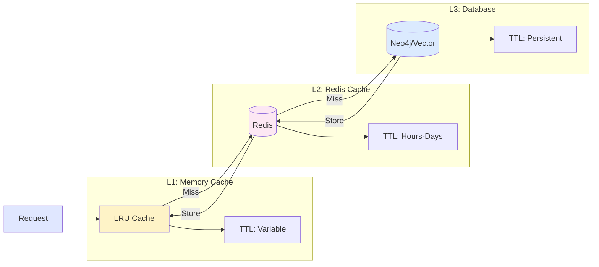
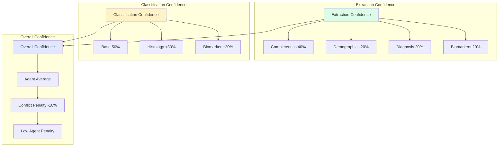

# LCA Enhanced System Architecture

## System Overview

## Data Flow

### 1. Chat Conversation Flow

### 2. File Upload Flow

### 3. Agent Execution with Transparency

### 4. Export Flow

## Component Architecture

### Service Layer Components

## Technology Stack

### Frontend
- **Next.js 14** - React framework
- **TypeScript** - Type safety
- **TailwindCSS** - Styling
- **React Markdown** - Markdown rendering
- **EventSource** - SSE streaming

### Backend
- **FastAPI** - REST API + SSE
- **Python 3.10+** - Core language
- **LangChain** - Agent orchestration
- **Ollama** - LLM inference

### Services
- **PyPDF2** - PDF parsing
- **python-docx** - DOCX parsing
- **ReportLab** - PDF generation
- **FHIR Resources** - FHIR R4 models

### Data
- **Neo4j** - Graph database
- **FAISS** - Vector store
- **OWLReady2** - Ontology reasoning

## Deployment Architecture

## Security Architecture

## Caching Strategy

## Confidence Scoring System

---

## Key Metrics

### Performance Targets
- **API Response**: < 200ms (cached)
- **First Analysis**: < 30s (uncached)
- **Cached Analysis**: < 100ms
- **File Upload**: < 5s (10MB PDF)
- **PDF Export**: < 2s
- **SSE Latency**: < 500ms

### Availability Targets
- **Uptime**: 99.9% (3 nines)
- **Error Rate**: < 0.1%
- **Cache Hit Rate**: > 85%

### Scalability Targets
- **Concurrent Users**: 100+
- **Requests/sec**: 1000+
- **Database Connections**: 100 pool

---

## Monitoring & Observability

### Metrics to Track
1. **Cache Performance**
   - Hit rate per cache type
   - Average latency
   - Memory usage

2. **Agent Performance**
   - Execution time per agent
   - Confidence scores
   - Failure rate

3. **API Performance**
   - Request latency (p50, p95, p99)
   - Error rate
   - Throughput

4. **LLM Performance**
   - Extraction accuracy
   - Response time
   - Ollama uptime

---

## References
- [ENHANCED_FEATURES_GUIDE.md](ENHANCED_FEATURES_GUIDE.md) - Implementation details
- [REMAINING_GAPS_ROADMAP.md](REMAINING_GAPS_ROADMAP.md) - Future work
- [PROJECT_GAPS_ANALYSIS.md](PROJECT_GAPS_ANALYSIS.md) - Gap analysis
