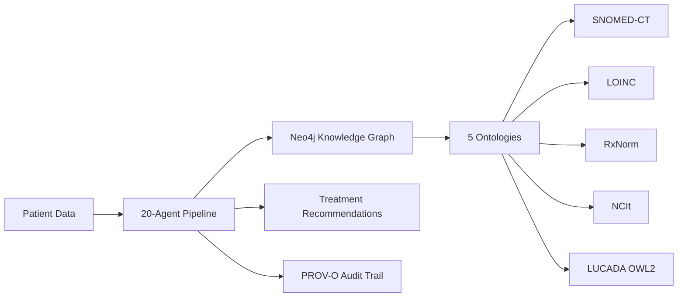
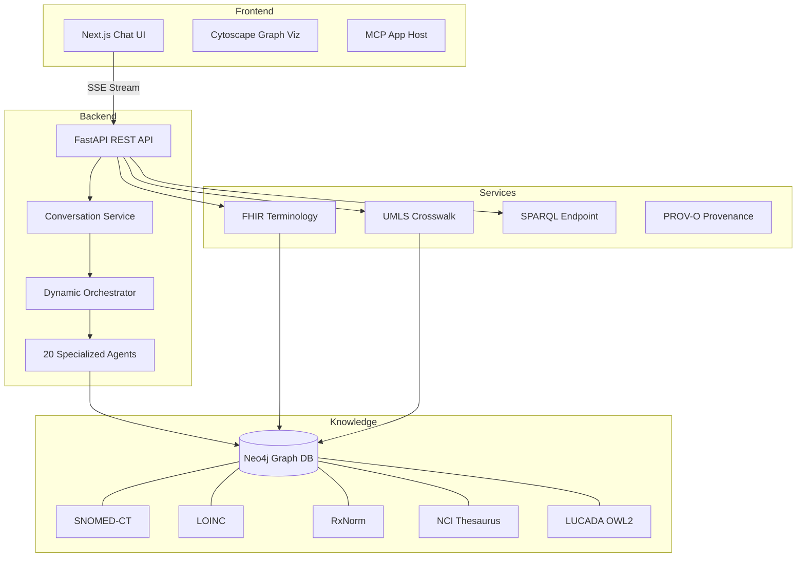
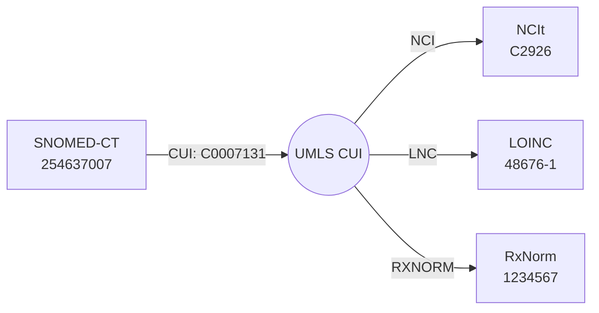
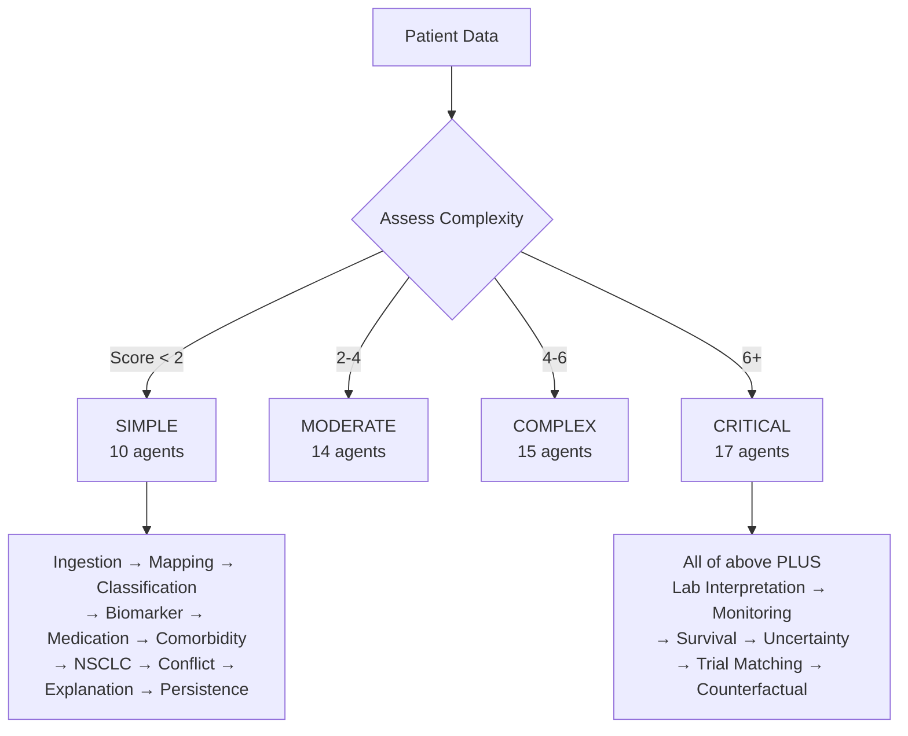
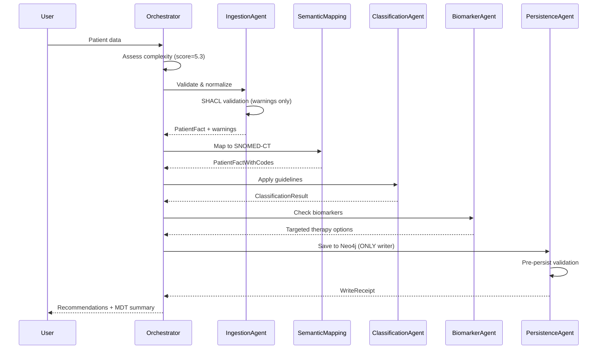
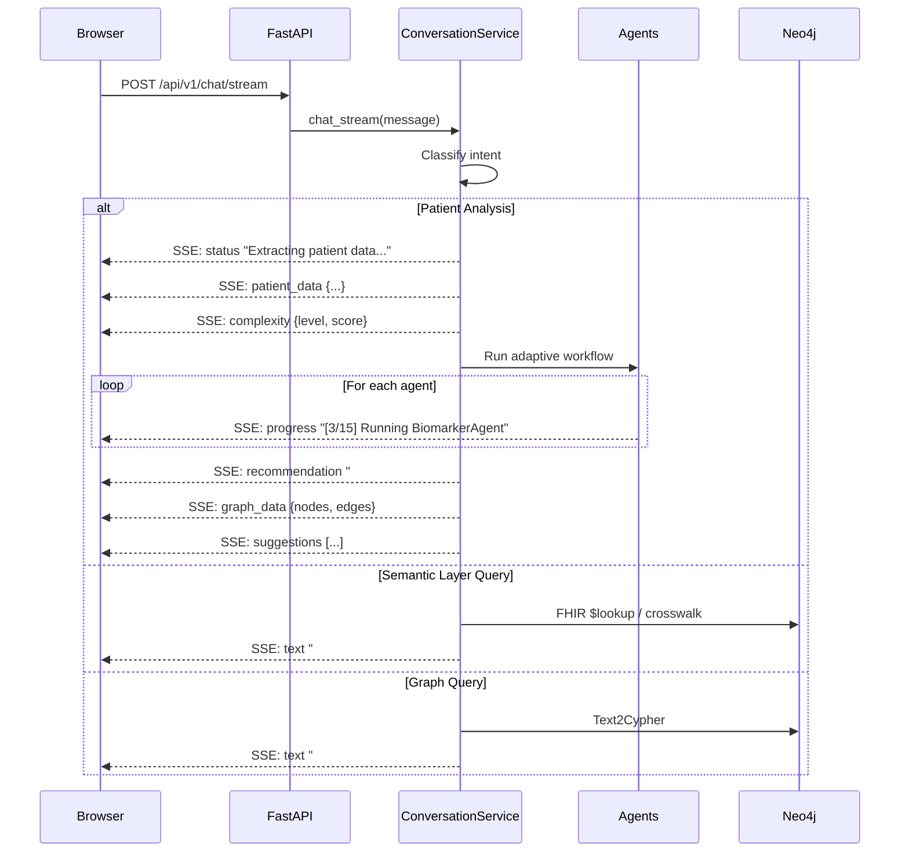
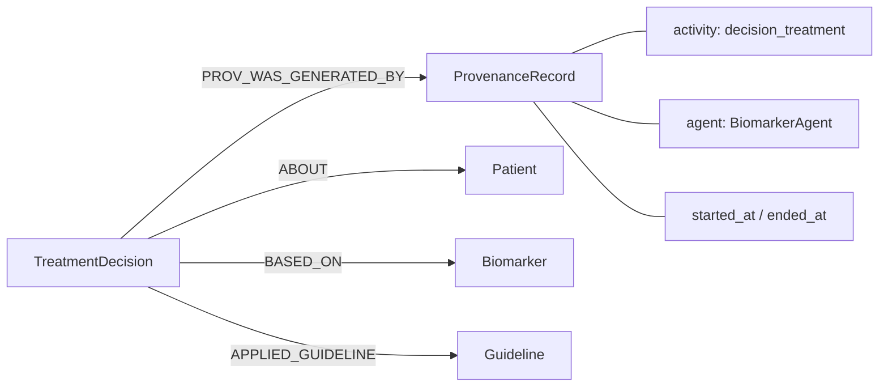
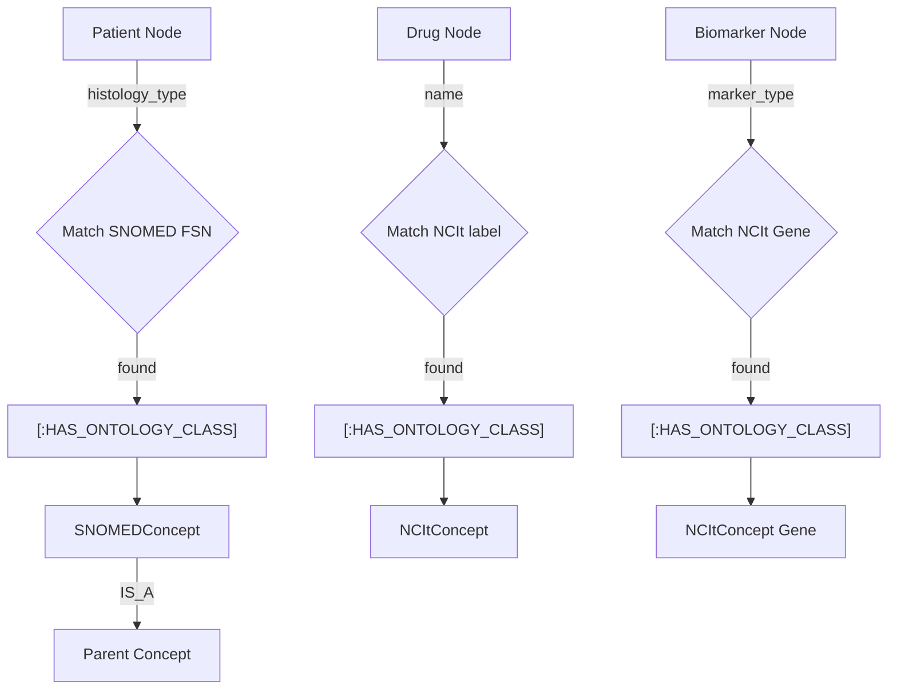

# Building CoherencePLM: An Ontology-Driven Clinical Decision Support System

> A deep dive into building a multi-agent, knowledge-graph-powered lung cancer assistant with SNOMED-CT, LOINC, RxNorm, NCIt, FHIR R4, and LangGraph orchestration.

---

## 1. What We Built

CoherencePLM is a clinical decision support system for lung cancer treatment. It combines:

- A **Neo4j knowledge graph** with 5 loaded ontologies
- A **20-agent pipeline** that analyzes patient cases
- A **conversational AI chat** with streaming responses
- **FHIR R4 terminology services** for standards-based interoperability
- **PROV-O provenance tracking** for every decision

The system takes a patient description like *"68M, stage IIIA adenocarcinoma, EGFR Ex19del+, PS 1"* and returns treatment recommendations backed by NCCN/NICE/ESMO guidelines, biomarker-therapy maps, drug interactions, and clinical trial matches.



---

## 2. Architecture Overview

### Tech Stack

| Layer | Technology |
|-------|-----------|
| Frontend | Next.js 14 + React + Tailwind CSS |
| Backend | FastAPI + Python 3.11 |
| Database | Neo4j 5.x (graph + vector store) |
| Ontology | Neosemantics (n10s) for OWL/RDF |
| LLM | Ollama (llama3.2) via LangChain |
| Workflow | LangGraph StateGraph |
| Standards | FHIR R4, SNOMED-CT, LOINC, RxNorm |

### System Architecture



---

## 3. The Ontology Layer

### Why Ontologies Matter

Clinical data is messy. A doctor might say "adenocarcinoma", "adeno", or "NSCLC-adenocarcinoma". Ontologies give us a canonical vocabulary:

- **SNOMED-CT**: 400K+ clinical concepts with IS_A hierarchy
- **LOINC**: 90K+ lab test codes with reference ranges
- **RxNorm**: 100K+ drug concepts with interactions
- **NCIt**: 170K+ cancer research concepts (Neoplasm, Drug, Gene)
- **LUCADA**: 68-class lung cancer data model (our domain ontology)

### Loading SNOMED-CT (RF2 Format)

SNOMED ships as tab-delimited RF2 files. We parse three files:

```
sct2_Concept_Snapshot  ->  Active concepts (concept_id, active)
sct2_Description_Snapshot  ->  FSN labels (concept_id, term)
sct2_Relationship_Snapshot  ->  IS_A hierarchy (source_id, dest_id)
```

For lung cancer, we compute a transitive closure from 22 root concepts (~5000 relevant concepts):

```python
LUNG_CANCER_ROOT_SCTIDS = {
    "363358000",   # Malignant neoplasm of lung
    "254637007",   # NSCLC
    "254632001",   # Small cell carcinoma of lung
    "35917007",    # Adenocarcinoma
    # ... 18 more roots
}

def _compute_transitive_closure(self, roots, parent_to_children):
    visited = set()
    stack = list(roots)
    while stack:
        node = stack.pop()
        if node in visited:
            continue
        visited.add(node)
        for child in parent_to_children.get(node, []):
            stack.append(child)
    return visited
```

Concepts become `:SNOMEDConcept` nodes with `[:IS_A]` edges in Neo4j.

### Loading NCIt (747MB OWL)

NCIt is too large for in-memory parsing. We use `iterparse` to stream-parse the OWL/XML:

```python
for event, elem in iterparse(owl_path, events=("start", "end")):
    if event == "start" and elem.tag == f"{{{OWL_NS}}}Class":
        # Extract class code from rdf:about
        current_class = extract_code(elem.get(f"{{{RDF_NS}}}about"))
    elif event == "end":
        if elem.tag == f"{{{RDFS_NS}}}subClassOf":
            # Record parent relationship
            parent_code = extract_code(elem.get(f"{{{RDF_NS}}}resource"))
        elif elem.tag == f"{{{OWL_NS}}}Class":
            # Save concept and clear memory
            concepts[current_class] = current_label
            elem.clear()  # Free memory
```

We filter to three roots: Neoplasm (C3262), Drug (C1908), Gene (C16612).

### UMLS Crosswalk

UMLS maps between all vocabularies via CUI (Concept Unique Identifier). We parse MRCONSO.RRF (1.7GB) filtered to 4 vocabularies:



---

## 4. The Agent Pipeline

### Adaptive Complexity Routing

Not every patient needs all 20 agents. The Dynamic Orchestrator assesses complexity:



Complexity factors:

| Factor | Score |
|--------|-------|
| Stage IV | +4.0 |
| PS 3-4 | +2.4-3.2 |
| Rare histology (not adeno/squamous) | +1.5 |
| Each actionable mutation | +0.5 |
| Contraindication comorbidity | +1.0 |
| Age extreme (<40 or >80) | +0.5 |

### Agent Architecture

Each agent has a single responsibility:



### SHACL-Style Validation

The IngestionAgent validates data against ontology constraints without blocking:

```python
def _validate_against_ontology(self, raw_data):
    warnings = []
    # Check histology against known ontology classes
    if normalized_hist not in VALID_HISTOLOGY_CLASSES:
        warnings.append(f"Histology '{histology}' not in known ontology")
    # Check TNM stage
    if normalized_tnm not in {"IA","IB","IIA","IIB","IIIA","IIIB","IV"}:
        warnings.append(f"TNM stage '{tnm}' not in valid set")
    # Check biomarker genes
    for marker in biomarkers:
        if gene not in KNOWN_GENE_SYMBOLS:
            warnings.append(f"Gene '{marker}' not recognized")
    return warnings  # Non-blocking: patient still processed
```

---

## 5. The Chat Interface

### SSE Streaming Architecture

The chat uses Server-Sent Events for real-time streaming:



### Intent Classification

The system classifies user messages into 9 intent types:

```
patient_analysis  ->  "68M stage IIIA adenocarcinoma..."
patient_lookup    ->  "Find patient PAT_001"
follow_up         ->  "What about side effects?"
graph_query       ->  "How many patients in the database?"
semantic_layer    ->  "Look up SNOMED code 254637007"
mcp_tool          ->  "Run biomarker agent for this patient"
mcp_app           ->  "Show Kaplan-Meier survival curve"
clustering        ->  "Find patients like this one"
general_qa        ->  "What is EGFR?"
```

### Dynamic Text2Cypher Schema

Instead of a hardcoded schema prompt, we query Neo4j for the live schema:

```python
def _build_dynamic_text2cypher_schema(self):
    # Query live schema
    node_props = session.run("CALL db.schema.nodeTypeProperties()")
    rel_props = session.run("CALL db.schema.relTypeProperties()")

    # Build prompt with actual labels and properties
    # Includes SNOMEDConcept, NCItConcept when loaded
    # Adds SHACL constraint hints
    # Caches for 10 minutes
```

This means after loading SNOMED/NCIt, the Text2Cypher prompt automatically knows about new node types.

---

## 6. FHIR R4 Terminology Services

### Three FHIR Operations

```mermaid
graph TB
    subgraph "$lookup"
        L1[GET /fhir/CodeSystem/$lookup] --> L2[system=http://snomed.info/sct]
        L2 --> L3[code=254637007]
        L3 --> L4["Display: NSCLC"]
    end

    subgraph "$translate"
        T1[GET /fhir/ConceptMap/$translate] --> T2[SNOMED 254637007]
        T2 --> T3[UMLS Crosswalk]
        T3 --> T4["NCIt: C2926"]
    end

    subgraph "$expand"
        E1[GET /fhir/ValueSet/$expand] --> E2[lung-cancer-histologies]
        E2 --> E3[Query SNOMED IS_A hierarchy]
        E3 --> E4["Adenocarcinoma, Squamous,<br/>Large Cell, ..."]
    end
```



Example: translating between vocabularies in the chat:

> **User:** Translate SNOMED 254637007 to NCIt
>
> **ConsensusCare:**
> | Field | Value |
> |-------|-------|
> | Source | `http://snomed.info/sct` : `254637007` |
> | Target | `http://ncicb.nci.nih.gov/...` : `C2926` |
> | Equivalence | equivalent |

---

## 7. PROV-O Provenance Tracking

Every treatment decision gets a provenance record:



The decision node stores PROV-O properties:
- `prov_generated_at`: When the decision was made
- `prov_was_derived_from`: Patient ID
- `prov_was_attributed_to`: Agent name

---

## 8. MCP Tool Integration

The system exposes 70+ tools via Model Context Protocol for Claude Desktop:

```json
{
  "mcpServers": {
    "lung-cancer-assistant": {
      "command": "python",
      "args": ["backend/src/mcp_server/lca_mcp_server.py"],
      "env": {
        "NEO4J_URI": "bolt://localhost:7687",
        "NEO4J_USER": "neo4j",
        "NEO4J_PASSWORD": "your_password"
      }
    }
  }
}
```

Tool categories:

| Category | Tools | Examples |
|----------|-------|---------|
| Patient Management | 8 | create_patient, find_similar_patients |
| Agent Workflow | 8 | run_6agent_workflow, run_ingestion_agent |
| Specialized Agents | 6 | run_biomarker_agent, run_nsclc_agent |
| Adaptive Workflow | 6 | assess_case_complexity, run_adaptive_workflow |
| Analytics | 7 | survival_kaplan_meier, match_clinical_trials |
| Knowledge Base | 6 | get_snomed_mapping, get_loinc_code |
| Semantic Layer | 10 | fhir_codesystem_lookup, execute_sparql |
| Digital Twin | 5 | create_digital_twin, get_twin_predictions |
| Graph & Export | 6 | query_neo4j, export_fhir |

---

## 9. Ontology Enrichment Flow

When a patient is analyzed, the system automatically enriches the graph:



---

## 10. Sample Conversations

### Patient Analysis

> **You:** 72-year-old female, stage IV adenocarcinoma, EGFR L858R mutation positive, PD-L1 15%, PS 1, comorbidities: hypertension, diabetes
>
> **ConsensusCare:** Runs 15 agents (COMPLEX path, score 5.8)
>
> **Result:** Osimertinib 80mg daily (FLAURA trial, OS 38.6mo), with monitoring protocol for hepatotoxicity and QTc prolongation.

### Follow-up Questions

After analysis, the system suggests:
1. "Would you like to know about potential side effects of osimertinib?"
2. "Should we discuss resistance mechanisms and second-line therapies?"
3. "Look up the SNOMED codes for this patient's biomarkers"
4. "Are you interested in current clinical trial options?"
5. "What ontologies are loaded in the system?"
6. "Expand lung cancer histologies value set"

### Semantic Layer Queries

> **You:** What ontologies are loaded?
>
> | Ontology | Count | Loaded |
> |----------|-------|--------|
> | SNOMED-CT Concepts | 5,234 | Yes |
> | NCIt Concepts | 12,456 | Yes |
> | LOINC codes | 68 | Yes |
> | RxNorm drugs | 65 | Yes |

> **You:** Expand lung cancer biomarkers value set
>
> | Code | Display |
> |------|---------|
> | EGFR | Epidermal Growth Factor Receptor |
> | ALK | ALK Receptor Tyrosine Kinase |
> | ROS1 | ROS Proto-Oncogene 1 |
> | ... | ... |

---

## 11. Questions to Try

### Starter Questions
1. **"68M, stage IIIA adenocarcinoma, EGFR Ex19del+, PS 1, COPD"** - Full patient analysis
2. **"What is first-line treatment for stage IV NSCLC with PD-L1 80%?"** - Guidelines Q&A
3. **"What ontologies are loaded in the system?"** - Check ontology status
4. **"How many patients are in the database?"** - Graph query
5. **"Expand lung cancer histologies value set"** - FHIR ValueSet expansion

### After Patient Analysis (Follow-ups)
6. **"What are the side effects of osimertinib?"** - Drug safety
7. **"Are there alternative treatments?"** - Explore options
8. **"Check drug interactions for this regimen"** - Safety check
9. **"Show similar patients from the database"** - Cohort analysis
10. **"What clinical trials is this patient eligible for?"** - Trial matching

### Semantic Layer Exploration
11. **"Look up SNOMED code 254637007"** - FHIR $lookup
12. **"Translate SNOMED 254637007 to NCIt"** - Vocabulary crosswalk
13. **"Expand lung cancer biomarkers value set"** - ValueSet expansion
14. **"Show provenance chain for [decision-id]"** - PROV-O audit trail

### Advanced
15. **"55F, stage IB large cell neuroendocrine, PS 0, post-surgical"** - Rare histology
16. **"Compare treatment options for KRAS G12C vs EGFR"** - MCP app
17. **"Cluster patients by stage and histology"** - Cohort clustering
18. **"What NCCN guidelines apply to stage IIIB with PS 2?"** - Guideline lookup

---

## 12. Key Design Decisions

### 1. Neo4j as a Tool, Not a Brain
Agents use Neo4j for storage and lookup, but reasoning happens in Python/LLM. Only the PersistenceAgent writes to Neo4j.

### 2. Non-Blocking Validation
SHACL-style validation produces warnings but never blocks patient processing. A misspelled histology still gets analyzed.

### 3. Dual-Mode Ontology Loading
Each ontology has two load paths: full (n10s/RRF/CSV) and subset (Python parsing with transitive closure). The system works with whatever data is available.

### 4. Dynamic Schema Discovery
The Text2Cypher prompt auto-discovers the Neo4j schema. When you load new ontologies, the LLM automatically knows about new node types.

### 5. Streaming Everything
Every response streams via SSE. You see each agent execute in real-time, with progress bars, log entries, and incremental results.

---

## 13. Running the System

```bash
# 1. Start Neo4j
neo4j start

# 2. Start backend
cd backend
pip install -r requirements.txt
uvicorn src.api.main:app --reload --port 8000

# 3. Start frontend
cd frontend
npm install
npm run dev

# 4. Load ontologies (one-time)
curl -X POST http://localhost:8000/api/v1/load-ontologies

# 5. Seed clinical data (one-time)
curl -X POST http://localhost:8000/api/v1/ingest-clinical-data

# 6. Run inference (one-time)
curl -X POST http://localhost:8000/api/v1/run-inference

# 7. Open browser
open http://localhost:3000/chat
```

---

## Summary

CoherencePLM demonstrates how to build a production-grade clinical decision support system by combining:

- **Standards-based ontologies** (SNOMED, LOINC, RxNorm, NCIt) for semantic interoperability
- **Multi-agent orchestration** with adaptive complexity routing
- **Knowledge graphs** (Neo4j) for persistent clinical reasoning
- **FHIR R4 terminology services** for healthcare system integration
- **Provenance tracking** (PROV-O) for audit and trust
- **Conversational AI** with streaming, follow-ups, and contextual suggestions

The key insight: ontologies are not just for validation. They drive routing decisions, enrich the knowledge graph, enable vocabulary translation, and make the LLM smarter through dynamic schema discovery.
