# Lung Cancer Assistant: A Deep Dive into Ontology-Driven Clinical Decision Support

## Building an AI-Powered Clinical Decision Support System with OWL Ontologies, SNOMED-CT, and Multi-Agent Architecture

---

## Table of Contents

1. [Introduction](#introduction)
2. [System Architecture Overview](#system-architecture-overview)
3. [The LUCADA Ontology](#the-lucada-ontology)
4. [SNOMED-CT Integration](#snomed-ct-integration)
5. [Clinical Guidelines as Rules](#clinical-guidelines-as-rules)
6. [The 6-Agent Workflow](#the-6-agent-workflow)
7. [Neo4j Knowledge Graph](#neo4j-knowledge-graph)
8. [Data Flow and State Management](#data-flow-and-state-management)
9. [Key Design Principles](#key-design-principles)
10. [Conclusion](#conclusion)

---

## Introduction

The **Lung Cancer Assistant (LCA)** is a clinical decision support system designed to help oncologists and multi-disciplinary teams (MDTs) make evidence-based treatment decisions for lung cancer patients. Based on the seminal work by Sesen et al. at the University of Oxford, this system combines:

- **OWL 2 Ontologies** for formal medical knowledge representation
- **SNOMED-CT** for standardized clinical terminology
- **NICE Clinical Guidelines** for evidence-based recommendations
- **Multi-Agent Architecture** for modular, auditable processing
- **Knowledge Graphs** for patient data persistence and querying

### The Clinical Challenge

Lung cancer treatment is inherently complex, involvig multiple variables that must be carefully considered to determine the optimal treatment pathway. Consider a typical scenario: A 68-year-old female patient presents with Stage IIIA adenocarcinoma, WHO Performance Status 1, and adequate lung function (FEV1 > 60%). Should she receive surgery, chemotherapy, radiotherapy, or a combination? What is the evidence level supporting each option? How do we ensure this decision is consistent with national guidelines?

Traditional clinical decision-making relies on clinician expertise and manual guideline review—a process that is time-consuming, prone to variability, and difficult to audit. The LCA system addresses these challenges by formalizing medical knowledge in machine-readable formats, enabling automated, consistent, and fully traceable treatment recommendations.

### Why Ontology-Driven Architecture?

Unlike rule-based expert systems that hardcode decision logic, the LCA uses **OWL 2 ontologies**—a formal knowledge representation language from the Semantic Web. This approach offers several advantages:
n
1. **Formal Semantics**: Relationships like "hasHistology" and "recommendedTreatment" have precise, machine-interpretable meanings
2. **Reasoning Capabilities**: OWL reasoners can infer new facts (e.g., "If patient has Stage IIIA NSCLC and PS 0-1, then patient is candidate for multimodal therapy")
3. **Interoperability**: OWL ontologies can be shared, extended, and integrated with other medical knowledge bases
4. **Maintainability**: Clinical guidelines can be updated by modifying the ontology without changing application code

This blog provides a comprehensive technical deep-dive into the system's architecture, with detailed Mermaid diagrams illustrating the core concepts and real-world examples demonstrating practical usage.

---

## System Architecture Overview

The LCA system follows a **layered architecture** with clear separation of concerns, inspired by Domain-Driven Design (DDD) and clean architecture principles. This architectural pattern ensures that medical reasoning logic remains independent of infrastructure concerns like databases and APIs.

### Architectural Layers Explained

The system is organized into four distinct layers, each with specific responsibilities:

**1. Presentation Layer**: This is where external systems interact with the LCA. Whether through REST APIs (FastAPI), the Model Context Protocol (MCP) server for LLM integration, or a command-line interface (CLI), all entry points are unified and delegate work to the application layer. For example, a hospital EHR system might call `POST /api/patients/{id}/classify` to get treatment recommendations via the FastAPI endpoint.

**2. Application Layer**: The heart of the system—a LangGraph workflow orchestrating six specialized agents. This layer coordinates the entire treatment recommendation pipeline, from ingesting raw patient data to generating MDT-ready clinical summaries. The workflow is stateful, maintaining context as data flows through each agent, and supports both synchronous and asynchronous processing.

**3. Domain Layer**: This is where medical knowledge lives. The LUCADA ontology defines what lung cancer concepts exist and how they relate. The Guideline Rules Engine encodes NICE CG121 clinical guidelines. The SNOMED-CT mapper provides standardized medical terminology. All clinical reasoning happens here—no business logic leaks into infrastructure code.

**4. Infrastructure Layer**: Pure technical concerns—Neo4j for graph database persistence, OWL file storage for ontology serialization. This layer has no knowledge of medical concepts; it simply stores and retrieves data as instructed by the domain layer.

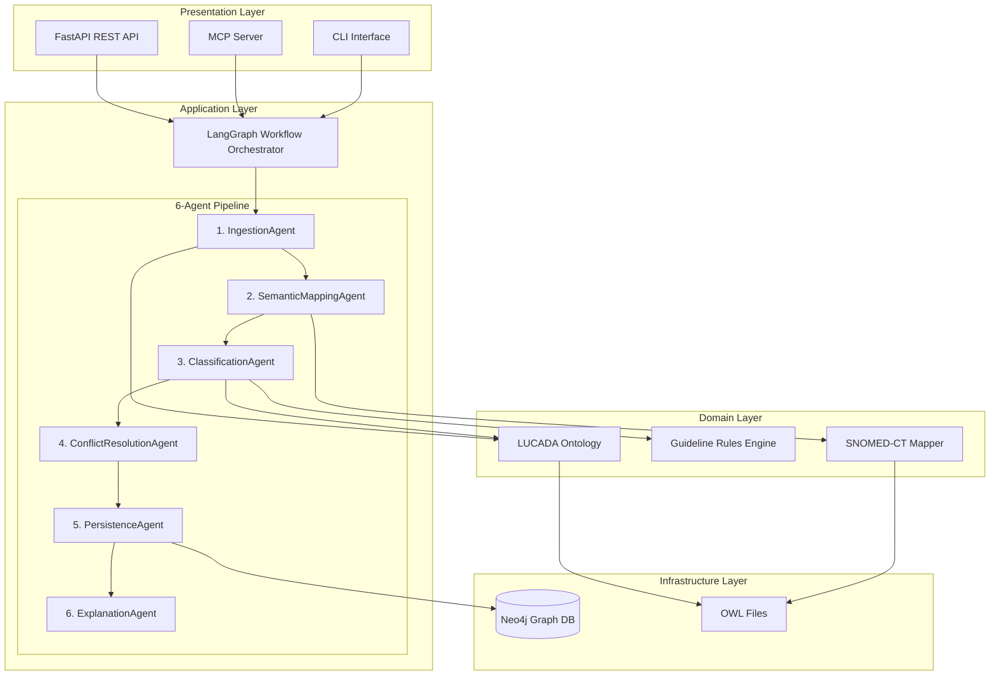

### Key Components

| Component | Purpose | Technology |
|-----------|---------|------------|
| **LUCADA Ontology** | Domain knowledge representation | OWL 2, owlready2 |
| **SNOMED-CT Mapper** | Clinical terminology standardization | SNOMED-CT OWL |
| **Guideline Rules** | Treatment recommendation logic | Python, OWL expressions |
| **6-Agent Workflow** | Processing pipeline | LangGraph, Pydantic |
| **Neo4j Database** | Knowledge graph storage | Neo4j, Cypher |
| **FastAPI Server** | REST API | FastAPI, Uvicorn |
| **MCP Server** | External tool integration | Model Context Protocol |

### Example: Processing a Patient Request

Let's trace a real patient through the system to understand how these layers interact:

**Input**: A clinician submits this JSON via the FastAPI endpoint:
```json
{
  "patient_id": "P12345",
  "age_at_diagnosis": 68,
  "sex": "Female",
  "tnm_stage": "IIIA",
  "histology_type": "Adenocarcinoma",
  "performance_status": 1,
  "fev1_percent": 65.0
}
```

**Flow**:
1. **Presentation Layer**: FastAPI receives the request at `/api/patients/P12345/classify`
2. **Application Layer**: LangGraph workflow activates the 6-agent pipeline
3. **Domain Layer**:
   - IngestionAgent validates the data
   - SemanticMappingAgent maps "Adenocarcinoma" → SNOMED code 35917007
   - ClassificationAgent determines patient scenario: "Locally Advanced Resectable NSCLC"
   - Rules engine matches Guideline R6: "Chemoradiotherapy for Stage IIIA/IIIB"
4. **Infrastructure Layer**: PersistenceAgent saves the complete inference to Neo4j
5. **Back to Presentation**: ExplanationAgent generates MDT summary, returned as JSON

**Output**:
```json
{
  "recommendations": [
    {
      "treatment": "Concurrent Chemoradiotherapy followed by Surgery",
      "evidence_level": "Grade A",
      "confidence": 0.92,
      "rule_id": "R6"
    }
  ],
  "clinical_summary": "68-year-old female with Stage IIIA adenocarcinoma, good PS. Candidate for trimodality therapy per NICE CG121.",
  "processing_time_ms": 1847
}
```

This layered approach ensures that if we later switch from Neo4j to PostgreSQL, only the Infrastructure Layer changes—the medical reasoning remains untouched.

---

## The LUCADA Ontology

LUCADA (LUng CAncer Decision Assistant) is an OWL 2 ontology that formalizes the lung cancer domain. It captures:

- Patient demographics and clinical data
- Histological classifications
- TNM staging system
- Treatment modalities
- Performance status
- Clinical argumentation

### Understanding OWL Ontologies in Healthcare

OWL (Web Ontology Language) is a formal language for representing complex knowledge structures. Unlike simple databases that store facts, ontologies define **what concepts exist** and **how they relate to each other**. This distinction is crucial in healthcare, where a "Stage IIIA adenocarcinoma" isn't just a text string—it's a concept with defined relationships to treatment protocols, prognosis expectations, and eligibility criteria for clinical trials.

In the LCA system, the LUCADA ontology serves as the "schema" for all clinical reasoning. When the system encounters a patient with "Adenocarcinoma" histology, it doesn't just pattern-match against rules—it understands that Adenocarcinoma is a subclass of Non-Small Cell Lung Cancer (NSCLC), which in turn determines which treatment guidelines apply.

**Example: How the Ontology Enables Reasoning**

Consider this scenario: A patient has "Large Cell Carcinoma" histology. The system needs to determine treatment options, but the guideline rules reference "NSCLC" not "Large Cell Carcinoma" specifically. Without an ontology, you'd need to hardcode every possible histology type into every rule. With the ontology, the system can reason:

```
Large Cell Carcinoma → subClassOf → NSCLC
NSCLC → hasApplicableGuidelines → [R1, R2, R3, R6, R7]
```

This inference happens automatically through the ontology's class hierarchy.

### Ontology Class Hierarchy

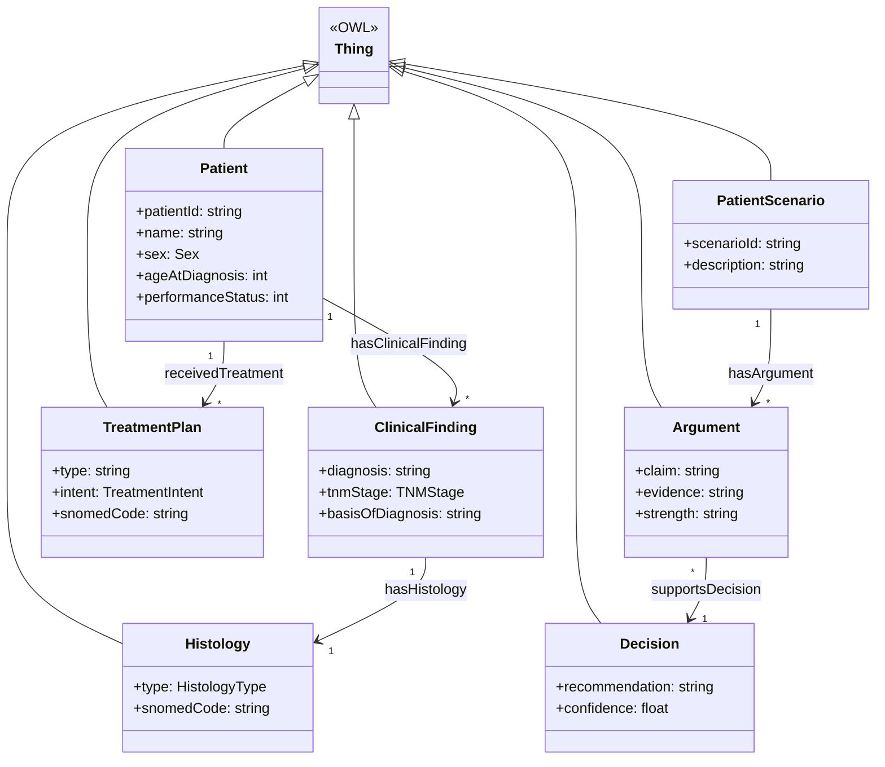

### Data Properties (LUCADA Figure 1)

The ontology defines 10 core data properties matching the original paper:

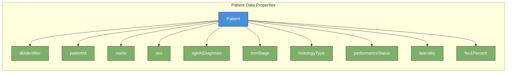

### Working with the Ontology in Python

The LCA system uses the **owlready2** library to load and manipulate OWL ontologies. Here's how the ontology is loaded and queried:

```python
from owlready2 import get_ontology

# Load the LUCADA ontology from file
lucada = get_ontology("lucada_ontology.owl").load()

# Access classes and properties
Patient = lucada.Patient
ClinicalFinding = lucada.ClinicalFinding

# Create a new patient instance
with lucada:
    patient = Patient("P12345")
    patient.ageAtDiagnosis = 68
    patient.tnmStage = "IIIA"
    patient.histologyType = "Adenocarcinoma"
    patient.performanceStatus = 1

# Query the ontology for all Stage III patients
stage_iii_patients = [p for p in Patient.instances() 
                      if p.tnmStage and p.tnmStage.startswith("III")]
```

The ontology file is serialized in OWL Functional Syntax format. When saved, it produces declarations like:

```owl
Declaration(Class(:Patient))
Declaration(DataProperty(:ageAtDiagnosis))
DataPropertyDomain(:ageAtDiagnosis :Patient)
DataPropertyRange(:ageAtDiagnosis xsd:integer)

Declaration(NamedIndividual(:P12345))
ClassAssertion(:Patient :P12345)
DataPropertyAssertion(:ageAtDiagnosis :P12345 "68"^^xsd:integer)
```

This formal representation enables external OWL reasoners (like HermiT or Pellet) to perform automated reasoning over the knowledge base.

---

## SNOMED-CT Integration

SNOMED-CT (Systematized Nomenclature of Medicine - Clinical Terms) provides a comprehensive clinical terminology with over 350,000 concepts. The LCA system maps clinical data to SNOMED-CT codes for interoperability.

### Why SNOMED-CT Matters for Healthcare Interoperability

Healthcare data suffers from a fundamental problem: the same clinical concept can be expressed in dozens of different ways. A "heart attack" might be recorded as "myocardial infarction," "MI," "cardiac infarction," or "coronary thrombosis" depending on the institution, clinician, or EMR system. This variability makes it nearly impossible to aggregate data across systems, compare outcomes, or apply consistent decision rules.

SNOMED-CT solves this by providing a **canonical identifier** (SCTID) for each clinical concept. When the LCA system encounters "Adenocarcinoma" in a patient record, it maps it to SNOMED code `35917007`. Now, whether the original record said "adenocarcinoma," "Adenocarcinoma of lung," or "ADENO CA," the system can consistently apply the same treatment guidelines.

Moreover, SNOMED-CT isn't just a flat list of codes—it's a full ontology with hierarchical relationships. This means the system can reason that `35917007` (Adenocarcinoma) is a subtype of `254637007` (Non-small cell lung cancer), which enables generalized rules to apply correctly.

### SNOMED Mapping Architecture

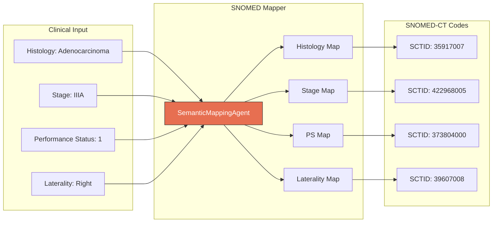

### Key SNOMED Concept Categories

| Category | Examples | SNOMED Codes |
|----------|----------|--------------|
| **Diagnoses** | Adenocarcinoma, NSCLC | 35917007, 254637007 |
| **Stages** | Stage IA, Stage IV | 422968005, 423032009 |
| **Treatments** | Chemotherapy, Surgery | 367336001, 387713003 |
| **Performance Status** | WHO Grade 0-4 | 373803006 - 373807007 |
| **Outcomes** | Complete Response | 268910001 |

### SNOMED-CT Loader: Parsing 378,000+ Concepts

The LCA system includes a custom SNOMED-CT loader that parses the official SNOMED OWL distribution files. These files are massive—the full SNOMED release contains over 378,000 classes, 126 Object Properties, and 378,000+ annotation labels.

Here's how the loader works:

```python
from backend.src.ontology.snomed_loader import SNOMEDCTLoader

# Load SNOMED-CT from OWL Functional Syntax file
loader = SNOMEDCTLoader()
snomed = loader.load_snomed_owl("ontology-2026-01-17_12-36-08.owl")

# Access loaded statistics
print(f"Classes loaded: {loader._class_count}")         # 378,416
print(f"Object Properties: {loader._obj_prop_count}")   # 126
print(f"Annotations: {loader._annotation_count}")       # 378,553

# Find concepts related to lung cancer
lung_cancer_concepts = snomed.search("*lung*cancer*")
for concept in lung_cancer_concepts[:5]:
    print(f"{concept.name}: {concept.label}")
```

The loader handles OWL Functional Syntax parsing, which differs from the more common RDF/XML format. This is important because SNOMED International distributes their terminology in this format for efficiency and precision.

---

## Clinical Guidelines as Rules

The system implements 7 formalized NICE CG121 guidelines as OWL-compatible rules:

Clinical guidelines like NICE CG121 are traditionally written in natural language for human clinicians. The challenge for a clinical decision support system is **formalization**—converting prose like "Consider surgical resection for patients with Stage I-II NSCLC who have adequate lung function and performance status 0-1" into machine-executable rules.

The LCA system addresses this through a structured rule representation that captures:

1. **Eligibility Criteria**: Which patients qualify for this recommendation?
2. **Treatment Modality**: What intervention is being recommended?
3. **Evidence Level**: How strong is the supporting evidence?
4. **Intent**: Curative vs. palliative?
5. **Priority**: When multiple rules match, which takes precedence?

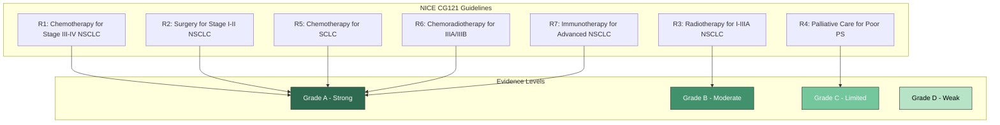

### Rule Structure

Each guideline rule contains:

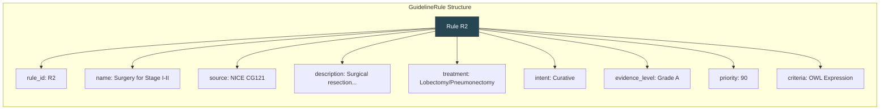

### Implementing Guidelines in Python

Each guideline rule is represented as a Python dataclass with an associated matching function. Here's how Rule R2 (Surgery for Stage I-II) is implemented:

```python
from dataclasses import dataclass
from typing import Callable

@dataclass
class GuidelineRule:
    rule_id: str
    name: str
    source: str
    description: str
    treatment: str
    intent: str  # "curative" or "palliative"
    evidence_level: str  # "Grade A", "Grade B", etc.
    priority: int  # Higher = more important
    criteria: Callable[[PatientFactWithCodes], bool]

# Rule R2: Surgery for Stage I-II NSCLC
R2 = GuidelineRule(
    rule_id="R2",
    name="Surgery for Stage I-II NSCLC",
    source="NICE CG121",
    description="Offer surgical resection to patients with Stage I-II NSCLC "
                "who are fit for surgery with adequate lung function",
    treatment="Lobectomy or Pneumonectomy",
    intent="curative",
    evidence_level="Grade A",
    priority=90,
    criteria=lambda p: (
        p.tnm_stage in ["IA", "IB", "IIA", "IIB"] and
        p.histology_type != "Small Cell Carcinoma" and
        p.performance_status <= 1 and
        (p.fev1_percent is None or p.fev1_percent >= 50)
    )
)
```

When a patient is processed, the ClassificationAgent iterates through all rules and collects those whose criteria match:

```python
def match_guidelines(patient: PatientFactWithCodes) -> List[GuidelineRule]:
    matching_rules = []
    for rule in ALL_GUIDELINE_RULES:
        if rule.criteria(patient):
            matching_rules.append(rule)
    return sorted(matching_rules, key=lambda r: -r.priority)
```

### Patient Classification Logic

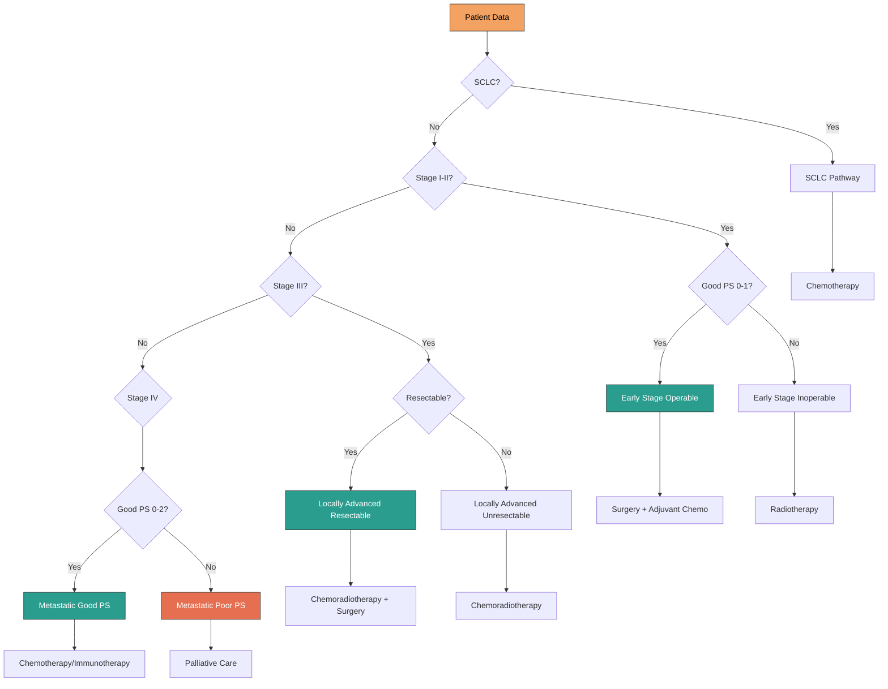

### Example: End-to-End Classification

Let's trace a specific patient through the classification logic:

**Patient**: 68-year-old female, Stage IIIA Adenocarcinoma, PS 1, FEV1 65%

1. **SCLC Check**: Is histology "Small Cell Carcinoma"? → **No** (Adenocarcinoma is NSCLC)
2. **Stage I-II Check**: Is stage in [IA, IB, IIA, IIB]? → **No** (Stage IIIA)
3. **Stage III Check**: Is stage in [IIIA, IIIB]? → **Yes**
4. **Resectable Check**: Is FEV1 ≥ 50% AND PS ≤ 2? → **Yes** (FEV1=65%, PS=1)
5. **Result**: Patient classified as **"Locally Advanced Resectable"**

Matching Rules:
- **R6**: Chemoradiotherapy for Stage IIIA/IIIB (Grade A, Priority 85)
- **R1**: Chemotherapy for Stage III-IV NSCLC (Grade A, Priority 80)

The ConflictResolutionAgent will prioritize R6 based on priority score and specificity.

---

## The 6-Agent Workflow

The heart of the LCA system is a 6-agent LangGraph workflow that processes patient data through a series of specialized agents.

### Why a Multi-Agent Architecture?

Traditional monolithic applications bundle all logic into a single codebase, making it difficult to test, maintain, or modify individual components. The LCA system takes a different approach inspired by microservices architecture: each agent has a **single responsibility** and communicates through well-defined interfaces.

This design provides several advantages:

1. **Testability**: Each agent can be unit-tested in isolation
2. **Maintainability**: Updating the classification logic doesn't affect persistence code
3. **Auditability**: The agent chain provides a clear audit trail of what happened at each step
4. **Extensibility**: New agents can be added without modifying existing ones
5. **Parallelization**: Independent agents could potentially run concurrently

The 6-agent workflow is orchestrated by LangGraph, a framework for building stateful, multi-step AI workflows. Each agent receives the current workflow state, performs its specific task, and updates the state for the next agent.

### Agent Pipeline Overview

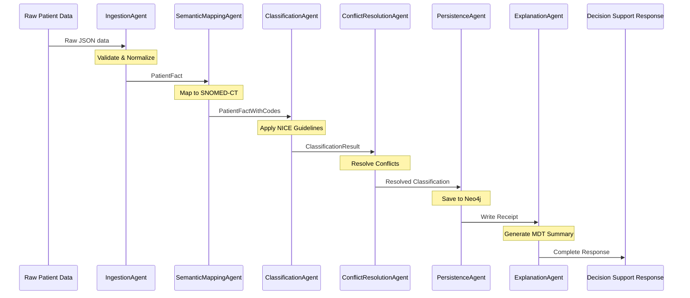

### Agent Responsibilities

```mermaid
graph TB
    subgraph "Agent 1: IngestionAgent"
        A1[IngestionAgent]
        A1_1[Validate required fields]
        A1_2[Normalize TNM staging]
        A1_3[Normalize histology types]
        A1_4[Calculate age groups]
        A1 --> A1_1
        A1 --> A1_2
        A1 --> A1_3
        A1 --> A1_4
    end

    subgraph "Agent 2: SemanticMappingAgent"
        A2[SemanticMappingAgent]
        A2_1[Map histology to SNOMED]
        A2_2[Map stage to SNOMED]
        A2_3[Map PS to SNOMED]
        A2_4[Calculate confidence]
        A2 --> A2_1
        A2 --> A2_2
        A2 --> A2_3
        A2 --> A2_4
    end

    subgraph "Agent 3: ClassificationAgent"
        A3[ClassificationAgent]
        A3_1[Determine patient scenario]
        A3_2[Match guideline rules]
        A3_3[Generate recommendations]
        A3_4[Build reasoning chain]
        A3 --> A3_1
        A3 --> A3_2
        A3 --> A3_3
        A3 --> A3_4
    end

    subgraph "Agent 4: ConflictResolutionAgent"
        A4[ConflictResolutionAgent]
        A4_1[Detect conflicts]
        A4_2[Apply evidence hierarchy]
        A4_3[Rank recommendations]
        A4_4[Deduplicate]
        A4 --> A4_1
        A4 --> A4_2
        A4 --> A4_3
        A4 --> A4_4
    end

    subgraph "Agent 5: PersistenceAgent"
        A5[PersistenceAgent]
        A5_1[Save patient facts]
        A5_2[Save inference result]
        A5_3[Create audit trail]
        A5_4[Return write receipt]
        A5 --> A5_1
        A5 --> A5_2
        A5 --> A5_3
        A5 --> A5_4
    end

    subgraph "Agent 6: ExplanationAgent"
        A6[ExplanationAgent]
        A6_1[Generate clinical summary]
        A6_2[Format recommendations]
        A6_3[List key considerations]
        A6_4[Create MDT discussion points]
        A6 --> A6_1
        A6 --> A6_2
        A6 --> A6_3
        A6 --> A6_4
    end

    style A1 fill:#e63946,stroke:#333,color:#fff
    style A2 fill:#f4a261,stroke:#333,color:#000
    style A3 fill:#2a9d8f,stroke:#333,color:#fff
    style A4 fill:#264653,stroke:#333,color:#fff
    style A5 fill:#9b2226,stroke:#333,color:#fff
    style A6 fill:#457b9d,stroke:#333,color:#fff
```

### Deep Dive: What Each Agent Does

**Agent 1: IngestionAgent**
The IngestionAgent is the gateway to the system. It receives raw patient data (typically JSON from an API or EHR system) and performs critical validation and normalization:

```python
def execute(self, patient_data: Dict[str, Any]) -> PatientFact:
    # Validate required fields
    required = ["patient_id", "age_at_diagnosis", "tnm_stage", "histology_type"]
    for field in required:
        if field not in patient_data:
            raise ValidationError(f"Missing required field: {field}")
    
    # Normalize TNM staging (handle variations like "3A" vs "IIIA")
    stage = self._normalize_stage(patient_data["tnm_stage"])
    
    # Normalize histology (handle abbreviations, synonyms)
    histology = self._normalize_histology(patient_data["histology_type"])
    
    return PatientFact(
        patient_id=patient_data["patient_id"],
        age_at_diagnosis=patient_data["age_at_diagnosis"],
        tnm_stage=stage,
        histology_type=histology,
        # ... other fields
    )
```

**Agent 2: SemanticMappingAgent**
Takes the normalized PatientFact and enriches it with SNOMED-CT codes. This enables interoperability with other systems and more precise guideline matching.

**Agent 3: ClassificationAgent**
The clinical brain of the system. Determines the patient's scenario (e.g., "Early Stage Operable NSCLC") and matches applicable guidelines.

**Agent 4: ConflictResolutionAgent**
When multiple guidelines match, this agent resolves conflicts based on evidence hierarchy, specificity, and clinical appropriateness.

**Agent 5: PersistenceAgent**
**THE ONLY AGENT THAT WRITES TO NEO4J.** This strict separation ensures data integrity and provides a single point for auditing all database modifications. It also generates patient embeddings for semantic similarity search.

**Agent 6: ExplanationAgent**
Generates human-readable clinical summaries suitable for MDT (Multi-Disciplinary Team) discussions.

### Neo4j Access Pattern

**CRITICAL PRINCIPLE: "Neo4j as a tool, not a brain"**

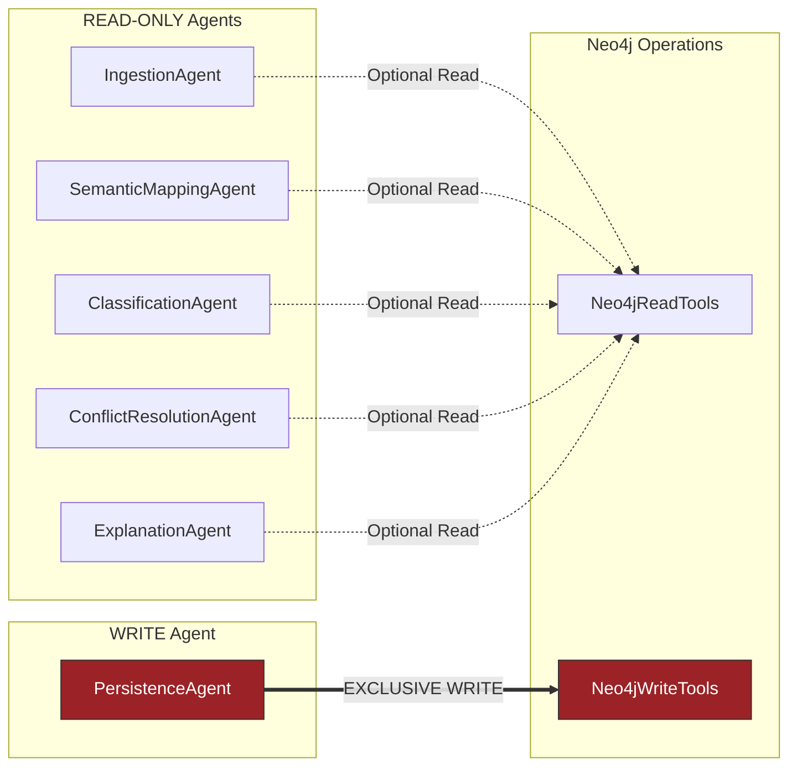

### Workflow Code Example

Here's how the 6-agent workflow is orchestrated using LangGraph:

```python
from langgraph.graph import StateGraph, END
from backend.src.agents import (
    IngestionAgent, SemanticMappingAgent, ClassificationAgent,
    ConflictResolutionAgent, PersistenceAgent, ExplanationAgent
)

class LCAWorkflow:
    def __init__(self, neo4j_read_tools, neo4j_write_tools, lucada, snomed):
        # Initialize all agents
        self.ingestion = IngestionAgent(lucada)
        self.semantic_mapping = SemanticMappingAgent(snomed)
        self.classification = ClassificationAgent(lucada)
        self.conflict_resolution = ConflictResolutionAgent()
        self.persistence = PersistenceAgent(neo4j_write_tools)
        self.explanation = ExplanationAgent()
        
        # Build the workflow graph
        self.graph = self._build_graph()
    
    def _build_graph(self) -> StateGraph:
        workflow = StateGraph(WorkflowState)
        
        # Add nodes for each agent
        workflow.add_node("ingestion", self._run_ingestion)
        workflow.add_node("semantic_mapping", self._run_semantic_mapping)
        workflow.add_node("classification", self._run_classification)
        workflow.add_node("conflict_resolution", self._run_conflict_resolution)
        workflow.add_node("persistence", self._run_persistence)
        workflow.add_node("explanation", self._run_explanation)
        
        # Define the linear flow
        workflow.set_entry_point("ingestion")
        workflow.add_edge("ingestion", "semantic_mapping")
        workflow.add_edge("semantic_mapping", "classification")
        workflow.add_edge("classification", "conflict_resolution")
        workflow.add_edge("conflict_resolution", "persistence")
        workflow.add_edge("persistence", "explanation")
        workflow.add_edge("explanation", END)
        
        return workflow.compile()
    
    def run(self, patient_data: Dict) -> DecisionSupportResponse:
        initial_state = WorkflowState(raw_patient_data=patient_data)
        final_state = self.graph.invoke(initial_state)
        return final_state.decision_support_response
```

---

## Neo4j Knowledge Graph

The Neo4j database stores patient data, inference results, and treatment outcomes in a graph structure.

### Why Neo4j for Clinical Data?

Graph databases like Neo4j excel at representing connected data—and healthcare data is inherently connected. A patient connects to their diagnoses, which connect to treatments, which connect to outcomes. In a relational database, these relationships require expensive JOIN operations; in Neo4j, they're first-class citizens.

Consider this query: "Find all patients similar to Patient P12345 who received chemotherapy and had complete response." In SQL, this requires multiple JOINs across patient, treatment, and outcome tables. In Cypher (Neo4j's query language), it's a simple graph traversal:

```cypher
MATCH (p:Patient {patient_id: 'P12345'})
MATCH (similar:Patient)-[:RECEIVED_TREATMENT]->(t:Treatment {type: 'Chemotherapy'})
      -[:HAS_OUTCOME]->(o:Outcome {response: 'Complete'})
WHERE p.tnm_stage = similar.tnm_stage 
  AND p.histology_type = similar.histology_type
RETURN similar, t, o
```

The LCA system also uses Neo4j's **vector search** capabilities (introduced in Neo4j 5.11+) to find semantically similar patients based on embeddings. This enables queries like "Find patients with similar clinical profiles" even when exact attribute matches aren't available.

### Graph Schema

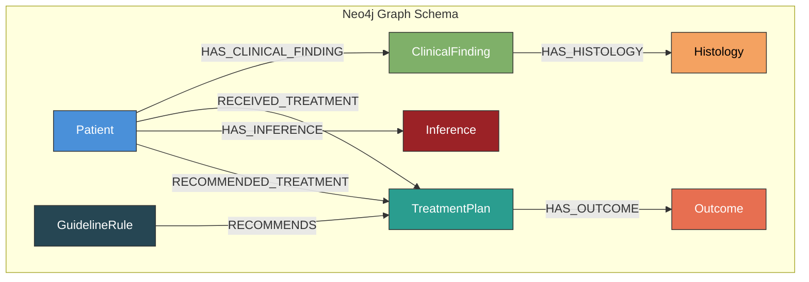

### Patient Node Properties

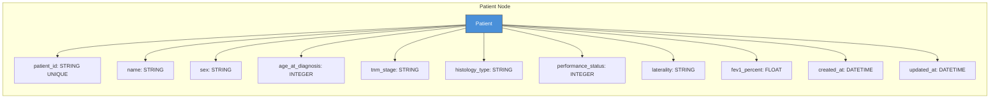

### Inference Audit Trail

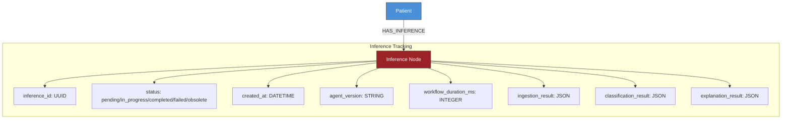

### Vector Search and Patient Embeddings

The LCA system generates embeddings for each patient using the `sentence-transformers` library. These 384-dimensional vectors capture the semantic essence of a patient's clinical profile, enabling similarity searches that go beyond exact attribute matching.

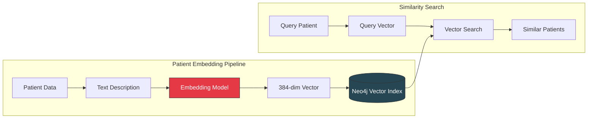

**How Patient Embeddings Work:**

```python
from sentence_transformers import SentenceTransformer

class PersistenceAgent:
    def __init__(self, write_tools, enable_embeddings=True):
        self.embedding_model = SentenceTransformer('all-MiniLM-L6-v2')
    
    def _generate_patient_embedding(self, patient, classification):
        # Create descriptive text capturing clinical profile
        text = f"""
        Lung cancer patient with {patient.tnm_stage} stage {patient.histology_type}.
        Age: {patient.age_at_diagnosis}. Performance Status: {patient.performance_status}.
        Clinical scenario: {classification.scenario}.
        Recommended treatments: {', '.join(r.treatment for r in classification.recommendations[:3])}.
        """
        
        # Generate 384-dimensional embedding
        embedding = self.embedding_model.encode(text.strip()).tolist()
        return embedding  # [0.023, -0.156, 0.892, ...]
```

The embedding is stored as a property on the Patient node in Neo4j:

```cypher
CREATE (p:Patient {
    patient_id: 'P12345',
    tnm_stage: 'IIIA',
    histology_type: 'Adenocarcinoma',
    embedding: [0.023, -0.156, 0.892, ...]  // 384 floats
})
```

To find similar patients:

```cypher
// Create vector index (one-time setup)
CREATE VECTOR INDEX patient_embeddings IF NOT EXISTS
FOR (p:Patient) ON (p.embedding)
OPTIONS {indexConfig: {
    `vector.dimensions`: 384,
    `vector.similarity_function`: 'cosine'
}}

// Find 5 most similar patients
MATCH (query:Patient {patient_id: 'P12345'})
CALL db.index.vector.queryNodes('patient_embeddings', 5, query.embedding)
YIELD node AS similar, score
RETURN similar.patient_id, similar.tnm_stage, similar.histology_type, score
```

---

## Data Flow and State Management

### Workflow State

The LangGraph workflow maintains state through the entire pipeline. This is crucial for several reasons:

1. **Traceability**: We can see exactly what data was available at each processing step
2. **Debugging**: If something goes wrong, we can inspect the state at any point
3. **Audit Compliance**: Healthcare regulations require complete records of decision-making processes

The workflow state is implemented as a Pydantic model that accumulates data as each agent completes:

```python
from pydantic import BaseModel
from typing import Optional, List
from datetime import datetime

class WorkflowState(BaseModel):
    # Input
    raw_patient_data: Dict[str, Any]
    
    # After IngestionAgent
    patient_fact: Optional[PatientFact] = None
    ingestion_timestamp: Optional[datetime] = None
    
    # After SemanticMappingAgent
    patient_with_codes: Optional[PatientFactWithCodes] = None
    snomed_mapping_confidence: Optional[float] = None
    
    # After ClassificationAgent
    classification_result: Optional[ClassificationResult] = None
    matched_guidelines: List[str] = []
    
    # After ConflictResolutionAgent
    resolved_classification: Optional[ClassificationResult] = None
    conflicts_detected: int = 0
    
    # After PersistenceAgent
    write_receipt: Optional[WriteReceipt] = None
    
    # After ExplanationAgent
    mdt_summary: Optional[MDTSummary] = None
    
    # Final output
    decision_support_response: Optional[DecisionSupportResponse] = None
    
    # Meta
    agent_chain: List[str] = []
    total_processing_time_ms: int = 0
    error_message: Optional[str] = None
```

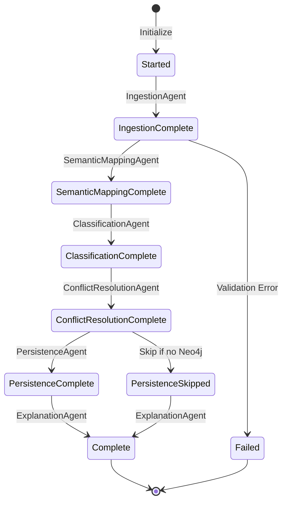

### Data Model Evolution

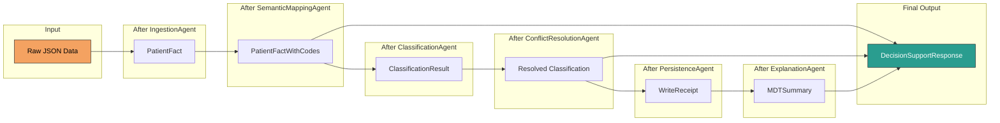

### Example: Complete Data Transformation

Let's trace the exact data transformations for our 68-year-old patient with Stage IIIA adenocarcinoma:

**Input (Raw JSON)**:
```json
{"patient_id": "P12345", "age_at_diagnosis": 68, "sex": "Female",
 "tnm_stage": "3A", "histology_type": "adeno", "performance_status": 1}
```

**After IngestionAgent (PatientFact)**:
```python
PatientFact(
    patient_id="P12345",
    age_at_diagnosis=68,
    sex="Female",
    tnm_stage="IIIA",           # Normalized from "3A"
    histology_type="Adenocarcinoma",  # Normalized from "adeno"
    performance_status=1,
    age_group="elderly"         # Calculated field
)
```

**After SemanticMappingAgent (PatientFactWithCodes)**:
```python
PatientFactWithCodes(
    ...all PatientFact fields...,
    snomed_codes={
        "histology": {"code": "35917007", "display": "Adenocarcinoma"},
        "stage": {"code": "422968005", "display": "Stage IIIA"},
        "performance_status": {"code": "373804000", "display": "WHO Grade 1"}
    },
    mapping_confidence=0.95
)
```

**After ClassificationAgent (ClassificationResult)**:
```python
ClassificationResult(
    patient_id="P12345",
    scenario="locally_advanced_resectable",
    recommendations=[
        Recommendation(treatment="Chemoradiotherapy + Surgery", rule_id="R6",
                       evidence_level="Grade A", confidence=0.92),
        Recommendation(treatment="Chemotherapy", rule_id="R1",
                       evidence_level="Grade A", confidence=0.85)
    ],
    reasoning_chain=["NSCLC detected", "Stage III identified", 
                     "Good PS allows aggressive treatment", "FEV1 adequate for surgery"]
)
```

**Final Output (DecisionSupportResponse)**:
```python
DecisionSupportResponse(
    patient_id="P12345",
    recommendations=[...],
    clinical_summary="68-year-old female with Stage IIIA adenocarcinoma and good PS...",
    mdt_discussion_points=["Surgery candidacy", "Neoadjuvant vs adjuvant chemo", ...],
    processing_metadata={
        "agent_chain": ["Ingestion", "SemanticMapping", "Classification", 
                        "ConflictResolution", "Persistence", "Explanation"],
        "processing_time_ms": 1847,
        "model_version": "1.0.0"
    }
)
```

---

## Key Design Principles

### 1. "Neo4j as a Tool, Not a Brain"

This principle is fundamental to the LCA architecture. It means that **all clinical reasoning happens in Python code and OWL ontologies**, not in Neo4j queries or stored procedures. Neo4j's role is strictly limited to:

- **Persistence**: Storing patient data and inference results
- **Retrieval**: Fetching historical records when needed
- **Similarity Search**: Finding similar patients via vector embeddings
- **Analytics**: Running aggregate queries for cohort statistics

Why does this matter? Consider what happens when you need to update a clinical guideline. If the reasoning logic is embedded in Neo4j stored procedures, you'd need to modify database code—a risky operation in a production healthcare system. With "Neo4j as a tool," you simply update the Python guideline rules, run tests, and deploy. The database schema doesn't change.

**Anti-pattern (Don't do this)**:
```cypher
// BAD: Clinical reasoning in Cypher
MATCH (p:Patient)
WHERE p.tnm_stage IN ['IA', 'IB'] AND p.performance_status <= 1
CREATE (p)-[:RECOMMENDED]->(t:Treatment {type: 'Surgery'})
```

**Correct pattern**:
```python
# GOOD: Clinical reasoning in Python
def recommend_treatment(patient: PatientFactWithCodes) -> List[Recommendation]:
    recommendations = []
    for rule in GUIDELINE_RULES:
        if rule.criteria(patient):
            recommendations.append(rule.to_recommendation())
    return recommendations

# Neo4j only stores the result
write_tools.save_inference(patient_id, recommendations)
```

All medical reasoning happens in Python/OWL. Neo4j is only used for:
- Data persistence
- Historical queries
- Similar patient lookup
- Cohort statistics

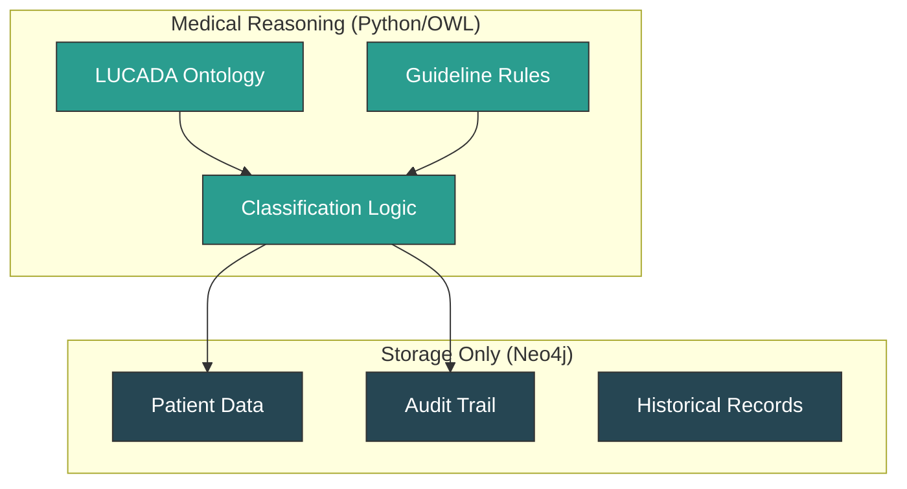

### 2. Strict Read/Write Separation

The LCA system enforces a strict boundary between agents that can read from Neo4j and the single agent that can write. This isn't just good practice—it's essential for healthcare systems where data integrity and audit compliance are legally mandated.

**Why only one write agent?**

1. **Single Point of Audit**: All database modifications flow through PersistenceAgent, making it trivial to log every change
2. **Transactional Consistency**: No risk of partial updates from different agents
3. **Rollback Capability**: If something goes wrong, we know exactly where to look
4. **Testing**: We can mock the write agent to test the entire pipeline without touching the database

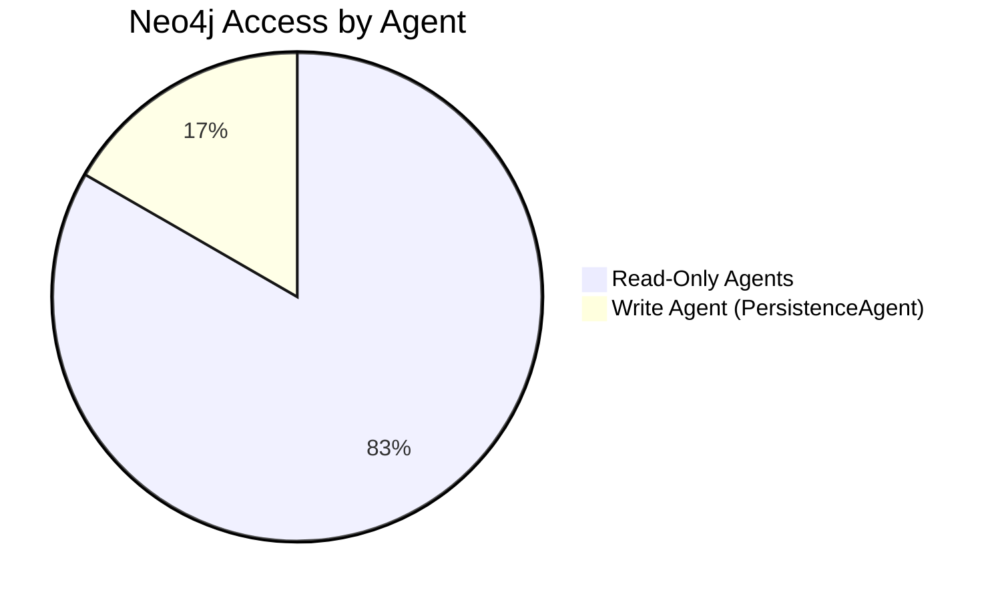

### 3. Complete Audit Trail

Every inference is tracked with:
- Timestamp
- Agent chain
- Input/output at each stage
- Version information
- Error messages

Healthcare regulations like HIPAA (US), GDPR (EU), and NHS Digital standards (UK) require that clinical decision support systems maintain comprehensive audit trails. The LCA system stores a complete record of every inference:

```python
@dataclass
class InferenceRecord:
    inference_id: str           # UUID for this specific inference
    patient_id: str             # Which patient
    status: InferenceStatus     # pending, in_progress, completed, failed
    created_at: datetime        # When the inference started
    completed_at: datetime      # When it finished
    agent_version: str          # Version of the agent pipeline
    llm_model: str              # If LLM was used, which model
    
    # Complete input/output at each stage
    ingestion_result: Dict      # Raw → PatientFact
    mapping_result: Dict        # PatientFact → PatientFactWithCodes
    classification_result: Dict # Clinical scenario + matched rules
    resolution_result: Dict     # Conflict resolution details
    explanation_result: Dict    # Final MDT summary
    
    # Metadata
    workflow_duration_ms: int   # Total processing time
    error_message: Optional[str]# If failed, why?
```

This enables queries like:
- "Show me all inferences for Patient P12345 in the last 30 days"
- "Which guideline rules were most frequently matched this month?"
- "What was the average processing time before and after the v2.0 update?"

### 4. Evidence-Based Recommendations

The evidence hierarchy is central to how the LCA system prioritizes recommendations. When multiple treatment options are applicable, the system ranks them based on the strength of supporting evidence:

- **Grade A (Strong)**: Based on meta-analyses of randomized controlled trials or at least one well-designed RCT
- **Grade B (Moderate)**: Based on well-designed controlled studies without randomization
- **Grade C (Limited)**: Based on comparative studies, correlation studies, or case series
- **Grade D (Weak)**: Based on expert committee reports or clinical experience of respected authorities

In practice, this means that if a patient qualifies for both Surgery (Grade A evidence) and Radiotherapy (Grade B evidence), Surgery will be ranked higher—though both will be presented to the clinician with their respective evidence levels.

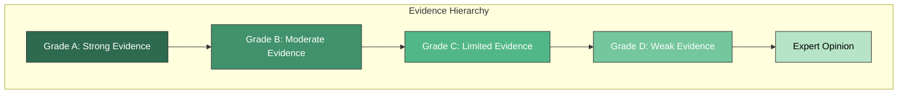

---

## MCP Server Integration

The MCP (Model Context Protocol) server exposes 18 tools for external integration:

The Model Context Protocol is an open standard that allows AI models (like Claude, GPT-4, etc.) to interact with external tools and data sources. For the LCA system, this means that large language models can directly access clinical decision support capabilities—enabling natural language interfaces to the system.

**Example: LLM Using MCP Tools**

A clinician asks Claude: "What treatment would you recommend for a 55-year-old male with Stage IIB adenocarcinoma and good performance status?"

Claude can use the MCP tools to:
1. Call `create_patient` to structure the data
2. Call `run_6agent_workflow` to get treatment recommendations
3. Call `generate_mdt_summary` to get a human-readable explanation

```python
# Claude's tool call (via MCP)
result = await mcp_client.call_tool("run_6agent_workflow", {
    "patient_data": {
        "patient_id": "temp_query_123",
        "age_at_diagnosis": 55,
        "sex": "Male",
        "tnm_stage": "IIB",
        "histology_type": "Adenocarcinoma",
        "performance_status": 1
    }
})

# Result includes full recommendations with evidence levels
print(result["recommendations"])
# [{"treatment": "Lobectomy + Adjuvant Chemotherapy", "evidence_level": "Grade A", ...}]
```

```mermaid
graph TB
    subgraph "MCP Server Tools"
        subgraph "Core Tools"
            T1[create_patient]
            T2[classify_patient]
            T3[generate_recommendations]
            T4[list_guidelines]
            T5[query_ontology]
            T6[get_ontology_stats]
        end

        subgraph "SNOMED Tools"
            T7[search_snomed]
            T8[get_snomed_concept]
            T9[map_patient_to_snomed]
            T10[generate_owl_expression]
            T11[get_lung_cancer_concepts]
        end

        subgraph "Workflow Tools"
            T12[run_6agent_workflow]
            T13[get_workflow_info]
            T14[run_ingestion_agent]
            T15[run_semantic_mapping_agent]
            T16[run_classification_agent]
            T17[generate_mdt_summary]
            T18[validate_patient_schema]
        end
    end

    EXT[External Applications] --> MCP[MCP Server]
    MCP --> T1
    MCP --> T7
    MCP --> T12

    style MCP fill:#e63946,stroke:#333,color:#fff
```

### MCP Tool Categories Explained

**Core Tools** provide the fundamental patient classification capabilities:
- `create_patient`: Creates a structured patient record from raw data
- `classify_patient`: Runs the full classification pipeline
- `generate_recommendations`: Gets treatment recommendations for a patient

**SNOMED Tools** enable terminology lookup and mapping:
- `search_snomed`: Free-text search across SNOMED-CT concepts
- `get_snomed_concept`: Retrieve details for a specific SNOMED code
- `map_patient_to_snomed`: Map all patient attributes to SNOMED codes

**Workflow Tools** provide fine-grained control over the agent pipeline:
- `run_6agent_workflow`: Execute the complete 6-agent pipeline
- `run_ingestion_agent`: Run just the ingestion step (useful for validation)
- `generate_mdt_summary`: Create a human-readable MDT discussion summary

---

## Conclusion

The Lung Cancer Assistant demonstrates how modern AI techniques can be combined with formal ontologies and clinical guidelines to create a robust, explainable clinical decision support system.

### Key Takeaways

1. **Ontology-Driven Design**: Using OWL 2 ontologies provides formal, machine-readable knowledge representation
2. **Standardized Terminology**: SNOMED-CT integration ensures interoperability with other healthcare systems
3. **Evidence-Based Rules**: Formalizing clinical guidelines as rules enables automatic, auditable recommendations
4. **Multi-Agent Architecture**: Breaking the system into specialized agents improves modularity and maintainability
5. **Strict Separation of Concerns**: "Neo4j as a tool, not a brain" ensures medical reasoning remains in the application layer
6. **Complete Audit Trail**: Every inference is tracked for regulatory compliance and quality assurance

### Future Directions

- Integration with hospital EHR systems
- Real-world validation with clinical data
- Expansion to additional cancer types
- Outcome tracking and continuous learning
- Biomarker-driven treatment recommendations

---

## References

1. Sesen, M.B. et al., "Lung Cancer Assistant: An Ontology-Driven Clinical Decision Support System", University of Oxford
2. NICE Clinical Guideline CG121: Lung Cancer
3. SNOMED International: SNOMED CT Documentation
4. W3C: OWL 2 Web Ontology Language

---

*This document is part of the Lung Cancer Assistant project. For more information, see the project README.*
